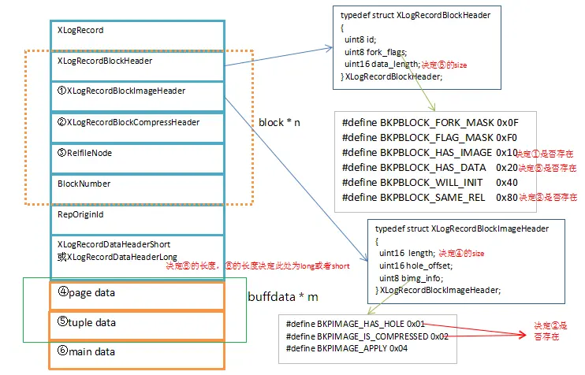

# structure of wal

# 1. WAL page struct

```C
typedef struct XLogPageHeaderData
{
	uint16		xlp_magic;		/* magic value for correctness checks */
	uint16		xlp_info;		/* flag bits, see below */
	TimeLineID	xlp_tli;		/* TimeLineID of first record on page */
	XLogRecPtr	xlp_pageaddr;	/* XLOG address of this page */

	/*
	 * When there is not enough space on current page for whole record, we
	 * continue on the next page.  xlp_rem_len is the number of bytes
	 * remaining from a previous page; it tracks xl_tot_len in the initial
	 * header.  Note that the continuation data isn't necessarily aligned.
	 */
	uint32		xlp_rem_len;	/* total len of remaining data for record */
} XLogPageHeaderData;

#define SizeOfXLogShortPHD	MAXALIGN(sizeof(XLogPageHeaderData))

typedef XLogPageHeaderData *XLogPageHeader;

/*
 * When the XLP_LONG_HEADER flag is set, we store additional fields in the
 * page header.  (This is ordinarily done just in the first page of an
 * XLOG file.)	The additional fields serve to identify the file accurately.
 * wal 
 */
typedef struct XLogLongPageHeaderData // for the first page of the first segment
{
	XLogPageHeaderData std;		/* standard header fields */ 
	uint64		xlp_sysid;		/* system identifier from pg_control 记录产生 segment 的数据库集簇的 id*/
	uint32		xlp_seg_size;	/* just as a cross-check, segment size*/
	uint32		xlp_xlog_blcksz;	/* just as a cross-check, page size*/
} XLogLongPageHeaderData;
```

# 2. WAL Record

## 2.1 XLogRecord

XLogRecord is the entrance of WAL recording. We should start with this struct.

```C
/*
 * The overall layout of an XLOG record is:
 *		Fixed-size header (XLogRecord struct)
 *		XLogRecordBlockHeader struct
 *		XLogRecordBlockHeader struct
 *		...
 *		XLogRecordDataHeader[Short|Long] struct
 *		block data
 *		block data
 *		...
 *		main data
 *
 * There can be zero or more XLogRecordBlockHeaders, and 0 or more bytes of
 * rmgr-specific data not associated with a block.  XLogRecord structs
 * always start on MAXALIGN boundaries in the WAL files, but the rest of
 * the fields are not aligned.
 *
 * The XLogRecordBlockHeader, XLogRecordDataHeaderShort and
 * XLogRecordDataHeaderLong structs all begin with a single 'id' byte. It's
 * used to distinguish between block references, and the main data structs.
 */

typedef struct XLogRecord
{
	uint32		xl_tot_len;		/* total len of entire record */
	TransactionId xl_xid;		/* xact id */
	XLogRecPtr	xl_prev;		/* ptr to previous record in log */
	uint8		xl_info;		/* flag bits, see below, sub type of wal record*/
	RmgrId		xl_rmid;		/* resource manager for this record. Type of wal record, in src/include/access/rmgrlist.h*/
	/* 2 bytes of padding here, initialize to zero */
	pg_crc32c	xl_crc;			/* CRC for this record 校验位, Cyclic redundancy check (循环冗余校验)*/

	/* XLogRecordBlockHeaders and XLogRecordDataHeader follow, no padding */

} XLogRecord;
```

## 2.2 BLOCK



### 2.2.1 XLogRecordBlockHeader

这部分的结构是通过 XLogRegisterBuffer 函数注册到 wal 记录中

```C
/*
 * Header info for block data appended to an XLOG record.
 *
 * 'data_length' is the length of the rmgr-specific payload data associated
 * with this block. It does not include the possible full page image, nor
 * XLogRecordBlockHeader struct itself.
 *
 * Note that we don't attempt to align the XLogRecordBlockHeader struct!
 * So, the struct must be copied to aligned local storage before use.
 */
typedef struct XLogRecordBlockHeader
{
	uint8		id;				/* block reference ID */
	uint8		fork_flags;		/* fork within the relation, and flags */
	uint16		data_length;	/* number of payload bytes (not including page
								 * image) */

	/* If BKPBLOCK_HAS_IMAGE, an XLogRecordBlockImageHeader struct follows */
	/* If BKPBLOCK_SAME_REL is not set, a RelFileNode follows */
	/* BlockNumber follows */
} XLogRecordBlockHeader;
```

- id：一个记录中可以有多个 block（MAX: 32），此 id 是 block 的序号。
- fork_flags: 本 block 存储有哪些信息，这个成员决定着①③结构和⑤数据是否存在。
- data_length: 决定⑤中存储的数据的长度。


### 2.2.2 XLogRecordBlockImageHeader

```C
/*
 * Additional header information when a full-page image is included
 * (i.e. when BKPBLOCK_HAS_IMAGE is set).
 *
 * The XLOG code is aware that PG data pages usually contain an unused "hole"
 * in the middle, which contains only zero bytes.  Since we know that the
 * "hole" is all zeros, we remove it from the stored data (and it's not counted
 * in the XLOG record's CRC, either).  Hence, the amount of block data actually
 * present is (BLCKSZ - <length of "hole" bytes>).
 *
 * Additionally, when wal_compression is enabled, we will try to compress full
 * page images using one of the supported algorithms, after removing the
 * "hole". This can reduce the WAL volume, but at some extra cost of CPU spent
 * on the compression during WAL logging. In this case, since the "hole"
 * length cannot be calculated by subtracting the number of page image bytes
 * from BLCKSZ, basically it needs to be stored as an extra information.
 * But when no "hole" exists, we can assume that the "hole" length is zero
 * and no such an extra information needs to be stored. Note that
 * the original version of page image is stored in WAL instead of the
 * compressed one if the number of bytes saved by compression is less than
 * the length of extra information. Hence, when a page image is successfully
 * compressed, the amount of block data actually present is less than
 * BLCKSZ - the length of "hole" bytes - the length of extra information.
 */
typedef struct XLogRecordBlockImageHeader
{
	uint16		length;			/* number of page image bytes */
	uint16		hole_offset;	/* number of bytes before "hole" */
	uint8		bimg_info;		/* flag bits, see below */

	/*
	 * If BKPIMAGE_HAS_HOLE and BKPIMAGE_COMPRESSED(), an
	 * XLogRecordBlockCompressHeader struct follows.
	 */
} XLogRecordBlockImageHeader;
```
- length：保存的 page 的总长度（压缩、去零后）。
- hole_offset: 零数据之前的数据的 size。
- bimg_info: 标志位，这里决定了②结构是否存在


### 2.2.3 XLogRecordBlockCompressHeader

```C
/*
 * Extra header information used when page image has "hole" and
 * is compressed.
 */
typedef struct XLogRecordBlockCompressHeader
{
	uint16		hole_length;	/* number of bytes in "hole" */
} XLogRecordBlockCompressHeader;
```

### 2.2.4 RelFilenode

此结构记录了此 block 所属的关系。如果当前 block 与上一个 block 来源于同一个文件那么 fork_flags 中就不会有 BKPBLOCK_SAME_REL 标志位

那么此 block 中就不会有 Relfilenode 结构.


```C
typedef struct RelFileNode
{
	Oid			spcNode;		/* tablespace */
	Oid			dbNode;			/* database */
	Oid			relNode;		/* relation */
} RelFileNode;
```

### 2.2.5 BlockNumber
block number of the page


# 3 RepOriginId

# 4 XLogRecordDataHeaderLong/ XLogRecordDataHeaderShort

```C
/*
 * XLogRecordDataHeaderShort/Long are used for the "main data" portion of
 * the record. If the length of the data is less than 256 bytes, the short
 * form is used, with a single byte to hold the length. Otherwise the long
 * form is used.
 *
 * (These structs are currently not used in the code, they are here just for
 * documentation purposes).
 */
typedef struct XLogRecordDataHeaderShort
{
	uint8		id;				/* XLR_BLOCK_ID_DATA_SHORT */
	uint8		data_length;	/* number of payload bytes */
}			XLogRecordDataHeaderShort;

#define SizeOfXLogRecordDataHeaderShort (sizeof(uint8) * 2)

typedef struct XLogRecordDataHeaderLong
{
	uint8		id;				/* XLR_BLOCK_ID_DATA_LONG */
	/* followed by uint32 data_length, unaligned */
}			XLogRecordDataHeaderLong;

#define SizeOfXLogRecordDataHeaderLong (sizeof(uint8) + sizeof(uint32))
```


# 5 buffdata

record 的结构图中的绿框部分是 buffdata，包含 pagedata 和 tupledata 两部分。pgdata 数据由 XLogRegisterBuffer () 函数注册到 wal 记录

tupledata 数据由 XLogRegisterBufData () 函数注册到 wal 记录。这里存储了实际的 buff 数据和变更数据。

比如这是一个 insert 语句产生的的 wal 日志，pgdata 可能保存了插入的目标 page 的备份。tupledata 可能保存了插入的 tuple 数据。


# 6 main data
main data 部分保存非 buff 性的数据，通过 XLogRegisterData () 函数注册的数据，比如 wal 子类型的特殊结构体、delete 和 update 语句的旧元组或 key


# wal write

```
